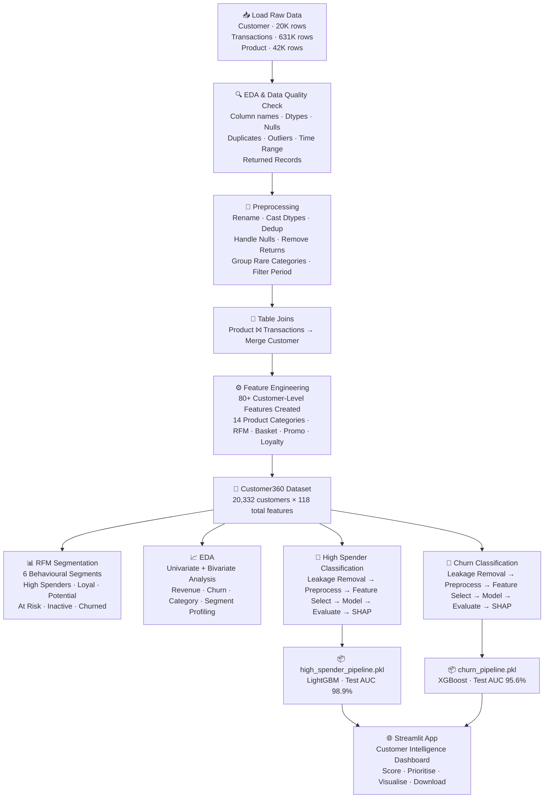
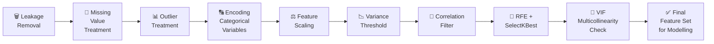
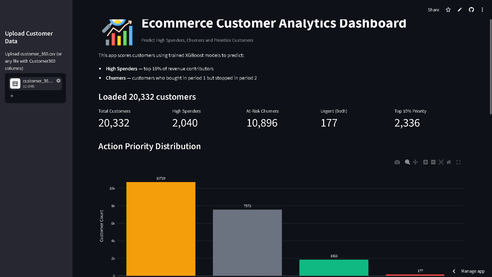

<div align="center">

<h1>🛒 E-Commerce Customer Analytics Platform</h1>


<br/>

**End-to-end Machine Learning platform to predict High Spenders, detect Churners, and unlock deep customer behavioural insights for a leading Indian e-commerce company**

<br/>


<br/>

| 📊 Customers | 🔴 Churn AUC | 💎 High Spender AUC | 👥 RFM Segments | 🤖 Models | 🏗️ Features |
|:---:|:---:|:---:|:---:|:---:|:---:|
| **20,332** | **95.6%** | **98.9%** | **6** | **6 per Task** | **118 (80+ Engineered)** |

</div>

---

## 📑 Table of Contents

- [🎯 Business Objective](#-business-objective)
- [📊 Dataset Overview](#-dataset-overview)
- [🔄 End-to-End Workflow](#-end-to-end-workflow)
- [⚙️ Data Preprocessing & Feature Engineering](#️-data-preprocessing--feature-engineering)
- [👥 RFM Customer Segmentation](#-rfm-customer-segmentation)
- [📈 Key Business Insights](#-key-business-insights)
- [🤖 ML Model Performance](#-ml-model-performance)
- [🔍 SHAP Explainability — Key Drivers](#-shap-explainability--key-drivers)
- [🔮 Upcoming Enhancements](#-upcoming-enhancements)
- [📂 Project Structure](#-project-structure)
- [🚀 Quick Start](#-quick-start)
- [📱 Streamlit Dashboard](#-streamlit-dashboard)
- [🛠️ Tech Stack](#️-tech-stack)
- [📬 Contact](#-contact)
  
---

## 🎯 Business Objective

A leading e-commerce company in India needed to move from gut-feel to **data-driven decision making** by mining 20K+ customers' transaction history. The business goals were:

| Business Goal | ML / Analytics Approach | Deliverable |
|:---|:---|:---|
| 🔴 **Identify customers at risk of churning** | Binary Classification | `churn_flag` predictions + key drivers |
| 💎 **Find and retain high-value spenders** | Binary Classification | `high_spenders_flag` predictions + key drivers |
| 🧠 **Understand overall customer behaviour** | RFM Segmentation + Profiling | 6 behavioural segments with distinct personas |
| 📣 **Enable precision marketing** | Segment-wise strategy design | Each segment gets a tailored action — VIP rewards for High Spenders, win-back offers for At-Risk, reactivation campaigns for Inactive — replacing one-size-fits-all promotions |

> 💼 **Core Business Insight:** Moving a customer up just **one RFM segment** (e.g., At-Risk → Potential) roughly **doubles their average spend** (₹658 → ₹1,819). The business does not need to find entirely new customers — re-engaging and upgrading existing ones is the highest-ROI opportunity this project unlocks.

---

## 📊 Dataset Overview

Three raw relational tables were provided by the business team:

| Table | Rows | Description | Key Fields |
|:---|---:|:---|:---|
| `Customer.csv` | 20,332 | Customer demographics & loyalty info | `customer_id`, `gender`, `city`, `loyalty_points` |
| `Transactions.csv` | 631,225 | Order-level transaction data | `order_id`, `sale_amount`, `discount`, `date`, `promo_flag` |
| `Product.csv` | 42,681 | Product hierarchy | `product_id`, `category`, `sub_category` |
| `customer_360.csv` *(generated)* | 20,332 | **One row per customer** — aggregated view | 118 features (80+ engineered) |
| `customer_scorecard.csv` *(generated by app)* | 20,332 | Scored + prioritised customer list | churn score, high-spender score, action priority |

---

## 🔄 End-to-End Workflow



---

## ⚙️ Data Preprocessing & Feature Engineering

### Data Quality Treatment

| Issue Found | Table | Fix Applied |
|:---|:---:|:---|
| Column names with spaces / overly long names | All | Renamed to clean `snake_case` |
| Wrong data types | Customer, Transactions | Cast date fields + loyalty point columns |
| Duplicate transactions | Transactions | Removed exact duplicates |
| Missing values | Customer, Product | Imputed / handled per-column logic |
| Returned records (negative `sale_amount`, `qty`, `customer_value`) | Transactions | Removed returns from all financial columns |
| Rare / low-frequency product categories | Product | Grouped into `Others` |
| Out-of-window records | Transactions | Filtered to required analysis period only |

---

### Feature Engineering — 80+ Features Created Across 9 Groups

<details>
<summary><b>🛒 Group 1 — Purchase Activity & History (5 features)</b></summary>

| Feature | Description |
|:---|:---|
| `first_purchase_flag` | Did the customer make their first purchase in the analysis period? |
| `recent_purchase_flag` | Did the customer purchase recently (within threshold)? |
| `recency_days` | Days since last purchase — primary RFM recency metric |
| `buyer_flag` | Binary: did the customer make any purchase at all? |
| `no_of_baskets` | Total number of purchase occasions (frequency — core RFM metric) |

</details>

<details>
<summary><b>📦 Group 2 — Transaction Volume (4 features)</b></summary>

| Feature | Description |
|:---|:---|
| `qty` | Total units purchased across all orders |
| `no_of_SKUs` | Total SKUs bought (including repeats) |
| `no_distinct_SKUs` | Unique SKUs purchased — product breadth |
| `no_categories` / `no_distinct_categories` | Total & unique categories explored |

</details>

<details>
<summary><b>🏷️ Group 3 — Category-Level Features (5 features × 14 categories = 70 features)</b></summary>

Applied across all **14 product categories**: Food, Beauty, Drinks, Kitchen_Clean, Imported_Food, Home, HH_Electrical, Mother_Child, Nutrition, Office_Computer, Mobiles, Digital, Car_Prods, Others

| Feature Pattern | Description |
|:---|:---|
| `cat_amount_{cat}` | Total spend per category |
| `cat_prod_cnt_{cat}` | Product count purchased per category |
| `cat_purchase_flag_{cat}` | Binary: did customer buy from this category? |
| `cat_first_purchase_{cat}` | First purchase date in that category |
| `cat_penetration_{cat}` | Share of purchases from this category |

</details>

<details>
<summary><b>💰 Group 4 — Financial & Period-Split Revenue (8 features)</b></summary>

| Feature | Description |
|:---|:---|
| `sale_amount` | Total revenue (core RFM monetary metric) |
| `p1_sales_amount` | Revenue in Period 1 (used to define churn / high-spender flags) |
| `p2_sales_amount` | Revenue in Period 2 |
| `act_amount` | Actual amount paid after discount |
| `cost_amount` | Cost of goods sold |
| `margin` | Total margin earned |
| `discount` | Total discount given |
| `decile_sale_amount` / `decile_margin` | Revenue & margin deciles (1–10) |

</details>

<details>
<summary><b>📐 Group 5 — Basket Averages (6 features)</b></summary>

| Feature | Description |
|:---|:---|
| `avg_sale_amount` | Average transaction value per basket |
| `avg_qty` | Average units per basket |
| `avg_no_prods` | Average distinct products per basket |
| `avg_no_cat` | Average categories visited per shopping occasion |
| `avg_margin` | Average margin per transaction |
| `avg_discount` | Average discount received per transaction |

</details>

<details>
<summary><b>🎯 Group 6 — Margin & Discount Ratios (2 features)</b></summary>

| Feature | Description |
|:---|:---|
| `margin_pct` | Margin as % of revenue — pricing efficiency |
| `discount_pct` | Discount as % of revenue — price sensitivity indicator |

</details>

<details>
<summary><b>📅 Group 7 — Promotional & Time Behaviour (10 features)</b></summary>

| Feature | Description |
|:---|:---|
| `weekday_orders` / `weekend_orders` | Split of orders by day type |
| `weekend_flag` | Is the customer primarily a weekend shopper? |
| `without_promo_orders` / `promo_orders` | Split of orders by promo vs non-promo |
| `promo_prods` | Number of promotional products bought |
| `products_with_discount` / `products_without_discount` | Full-price vs discounted product counts |
| `promo_prod_pct` | % of products bought on promotion |
| `pct_pur_with_promo_prods` | % of purchase occasions that included a promo item |
| `promo_flag` / `promo_seeker_flag` | Is customer promo-active / a heavy promo-seeker? |

</details>

<details>
<summary><b>🏆 Group 8 — Behavioural Flags (3 features)</b></summary>

| Feature | Description |
|:---|:---|
| `multi_cat_flag` | Does the customer shop across multiple categories? |
| `redeem_flag` | Has the customer redeemed loyalty points? |
| `buyer_flag` | Did the customer make any purchase in the period? |

</details>

<details>
<summary><b>👥 Group 9 — Segmentation Label (1 feature)</b></summary>

| Feature | Description |
|:---|:---|
| `customer_segment` | RFM segment label: High Spender / Loyal / Potential / At Risk / Inactive / Churned |

</details>

---

### ML Preprocessing Pipeline (Applied Separately to Each Target)



> Leakage removal is the **first** step — any feature derived from the target variable or that would not be available at inference time is dropped before any preprocessing begins.

---

## 👥 RFM Customer Segmentation

Six distinct behavioural segments were identified using RFM scoring on the Customer360 dataset:

<div align="center">

| Segment | Customers | Avg Revenue | Avg Orders | Avg Recency | Avg Loyalty Pts | Business Strategy |
|:---:|:---:|:---:|:---:|:---:|:---:|:---|
| 💎 **High Spenders** | 560 | ₹7,769 | 35 | 13 days | 2,800 | Premium rewards · Early product access · VIP service |
| ⭐ **Loyal** | 1,293 | ₹3,704 | 19 | 22 days | 1,676 | Tier upgrades · Personalised recommendations |
| 🌱 **Potential** | 2,863 | ₹1,819 | 10 | 32 days | 962 | Bundle offers · Cross-category promotions |
| ⚠️ **At Risk** | 5,584 | ₹658 | 4 | 43 days | 378 | Win-back discounts · Push notifications · Urgency offers |
| 😴 **Inactive** | 5,965 | ₹368 | 2 | 123 days | 221 | Reactivation campaigns · Time-limited discount codes |
| 🚨 **Churned** | 4,067 | ₹207 | 1 | 268 days | 165 | Deep win-back · Exit surveys · Last-resort offers |

</div>

> **Key Pattern:** High Spenders almost never use promos (rate: 0.01) and are the most active loyalty participants (2,800 avg pts). Churned customers averaged **268 days of inactivity** and near-zero loyalty engagement (165 pts) — the clearest signal of full disengagement. Moving a customer **one segment up** roughly doubles their spend.

---

## 📈 Key Business Insights

<details>
<summary><b>📦 Category Performance — Revenue, Churn & High Spender Concentration</b></summary>

<br/>

| Category | Customers | Churn Rate | High Spender % | Insight |
|:---|:---:|:---:|:---:|:---|
| Food | 12,917 | **18.4%** | 13.4% | Largest base + highest churn — #1 retention priority |
| Drinks | 10,698 | **17.6%** | 15.2% | Routine category — drop in spend signals churn early |
| Beauty | 11,324 | 16.5% | 14.9% | Consistent across all segments — mass-market staple |
| Kitchen & Clean | 10,816 | 16.3% | 15.6% | Household staple; cross-sell with Food customers |
| Imported Food | 10,767 | 15.6% | 15.0% | Above-average churn; higher-margin opportunity |
| Home | 5,127 | 12.4% | **23.3%** | Growing High Spender share — invest in assortment |
| HH Electrical | 4,186 | 14.8% | **25.8%** | Premium lifestyle category |
| Mother & Child | 4,111 | 14.3% | **25.1%** | High-value family segment; strong retention |
| Office/Computer | 2,116 | 13.5% | **31.3%** | Strong High Spender signal — ideal for VIP targeting |
| Mobiles | 758 | 12.3% | **37.6%** | Highest High Spender concentration — cross-sell potential |
| Digital | 814 | 14.6% | **33.0%** | Premium digital buyers — lowest churn in tech |
| Car Products | 580 | **9.3%** | 30.3% | **Lowest churn across all categories** — most loyal buyers |

> 💡 **Food + Imported Food + Beauty + Drinks → ~55–60% of total revenue.** Mobiles, Digital & Office are niche but carry the highest concentration of High Spenders — strong VIP and cross-sell targets.

</details>

<details>
<summary><b>🔴 Churn vs Non-Churn — Behavioural Contrast</b></summary>

<br/>

- Non-churned customers generate **2.6× higher sales** and make **3× more purchases** than churned customers.
- Churned customers contribute **61% lower revenue** and make **67% fewer purchases**, highlighting declining engagement well before actual churn.
- Churned customers shop across fewer categories and earn significantly fewer loyalty points, indicating weaker overall brand engagement.
- Customer value declines steadily as recency increases (Potential → At Risk → Inactive → Churned), making **recency a strong early warning signal** even before a customer fully churns.
- Churned customers exhibit the **highest promo-seeking behaviour (29%)**, compared with highly engaged segments such as High Spenders (1%) and Loyal customers (2%) — indicating they were discount-driven from the start.

> **Key Takeaway:** Churn is primarily driven by **declining engagement** — fewer purchases, lower category exploration, longer inactivity, and weaker loyalty participation. Focus retention efforts on **reactivating customers before they move into At-Risk and Inactive stages**, rather than relying solely on discounts. Push notifications and engagement reminders outperform blanket discount campaigns.

</details>

<details>
<summary><b>💎 High Spenders vs Other Segments — Behavioural Contrast</b></summary>

<br/>

- High Spenders generate the highest sales (₹7,769) and make the most purchases (35 baskets) across all segments.
- They shop across **194 categories on average** — nearly 2× Loyal customers and far above all other segments — reflecting deep, broad brand engagement.
- Despite receiving discounts (~17%), their **promo-seeking rate is only 0.01**, the lowest among all segments, indicating they are not discount-driven buyers.
- They are the **most engaged customers** — highest points earned (2,800 avg), lowest recency, and most frequent purchasers across all segments.
- **Nearly all High Spenders are multi-category shoppers (99%)**, reflecting comprehensive engagement with the brand's product range.

> **Key Takeaway:** High Spenders are loyal, highly engaged, and broad-category shoppers. Their value is driven by **frequent purchasing and deep brand engagement rather than promotion dependency**, making VIP programmes, loyalty tier upgrades, and early product access the most effective retention strategies.

</details>

<details>
<summary><b>📊 Bivariate Analysis — Gender, Category & Spend Patterns</b></summary>

<br/>

**Gender:**
- Female customers are more valuable — they churn less (**18% vs 22%**) and are more likely to become High Spenders (**16% vs 10%**) than male customers.
- Customers with unknown gender are the least engaged — they have the **highest churn rate (32%)** and the **lowest High Spender rate (7%)**, making data completeness itself a risk signal.

**Category & Revenue:**
- Food, Imported Food, Beauty, and Drinks generate nearly **60% of total revenue** — ensuring availability and fast delivery in these categories is mission-critical.
- Food is the most important category — it has the largest customer base but also the **highest churn rate**, making it the #1 focus area for both acquisition and retention.
- Customers who buy Food are strong candidates for **cross-recommendations** in Kitchen & Clean, Nutrition, and Home categories.
- Home, HH Electrical, Office/Computer, Mobiles, and Digital attract **more High Spender customers** than other categories.
- Mobiles, Digital, Office/Computer, and Car Products have the **highest concentration of High Spenders** — ideal categories for VIP programmes and premium offers.
- Digital, Car Products, and Others contribute relatively little revenue today, but they have **strong High Spender potential** and can be grown through bundles and targeted promotions.
- **Car Products customers are highly loyal** — they have the lowest churn rate and one of the highest High Spender rates across all categories.

</details>

<details>
<summary><b>📉 Univariate Analysis Highlights</b></summary>

<br/>

- Revenue is **highly concentrated** in a small group — classic Pareto (80/20) pattern in action.
- Most customers receive low-to-moderate discounts; very few are heavily discount-driven.
- Margins are balanced across the base — pricing strategy is relatively consistent.
- Majority are **one-time or low-frequency buyers** — high-frequency buyers form a small but disproportionately valuable minority.
- Most customers have very low basket counts; bulk buyers are rare but high-value.

</details>

---

## 🤖 ML Model Performance

### 💎 High Spender Classification

> 🏆 **Champion: XGBoost** — Test AUC **98.8%** · · Used in production pipeline

| Model | Train AUC | Test AUC | Train Precision | Test Precision | Train Recall | Test Recall | Train Accuracy | Test Accuracy |
|:---|:---:|:---:|:---:|:---:|:---:|:---:|:---:|:---:|
| Logistic Regression | 0.9863 | 0.9884 | 0.8688 | 0.8575 | 0.7860 | 0.8133 | 0.9667 | 0.9678 |
| Decision Tree | 0.9458 | 0.9465 | 0.7776 | 0.7324 | 0.8450 | 0.8673 | 0.9603 | 0.9550 |
| Random Forest | 0.9872 | 0.9848 | 0.8325 | 0.7977 | 0.8561 | 0.8526 | 0.9684 | 0.9636 |
| **XGBoost🏆** | 0.9907 | 0.9888 | 0.8404 | 0.8094 | 0.8875 | 0.8870 | 0.9719 | 0.9678 |
| SVC | 0.9860 | 0.9881 | 0.8759 | 0.8675 | 0.7811 | 0.8206 | 0.9670 | 0.9695 |
| LightGBM | **0.9905** | **0.9891** | **0.8506** | **0.8171** | **0.8752** | **0.8673** | **0.9721** | **0.9673** |

### 🔴 Churn Prediction

> 🏆 **Champion: XGBoost** — Test AUC **95.56%** · Best generalisation of all models tested

| Model | Train AUC | Test AUC | Train Precision | Test Precision | Train Recall | Test Recall | Train Accuracy | Test Accuracy |
|:---|:---:|:---:|:---:|:---:|:---:|:---:|:---:|:---:|
| Logistic Regression | 0.9354 | 0.9378 | 0.8186 | 0.8256 | 0.8394 | 0.8572 | 0.8645 | 0.8734 |
| Decision Tree | 0.9408 | 0.9330 | 0.8122 | 0.8098 | 0.8435 | 0.8364 | 0.8626 | 0.8592 |
| Random Forest | 0.9435 | 0.9437 | 0.8340 | 0.8334 | 0.8370 | 0.8503 | 0.8711 | 0.8750 |
| **XGBoost 🏆** | **0.9731** | **0.9556** | **0.8979** | **0.8620** | **0.8695** | **0.8572** | **0.9104** | **0.8906** |
| SVC | 0.9360 | 0.9398 | 0.8332 | 0.8470 | 0.8176 | 0.8440 | 0.8647 | 0.8794 |
| LightGBM | 0.9626 | 0.9535 | 0.8460 | 0.8394 | 0.8728 | 0.8698 | 0.8882 | 0.8840 |

> ✅ Both champion models are saved as **end-to-end sklearn-compatible `.pkl` pipelines** — all preprocessing, feature selection, and the trained model in a single object, ready for production inference with one `pipeline.predict()` call.

---

## 🔍 SHAP Explainability — Key Drivers

SHAP (SHapley Additive exPlanations) was used to explain every model prediction and surface the most actionable business drivers — turning the black-box model into a transparent decision tool.

### 💎 What Makes a High Spender?

```
Rank  Feature                          Direction     Business Meaning
───────────────────────────────────────────────────────────────────────────────────
  1   buy_times (Purchase Frequency)    ↑ Higher  →  Most powerful driver — shop more = spend more
  2   points_earned (Loyalty)           ↑ Higher  →  Active loyalty members are High Spenders
  3   cat_amount_Mobiles                ↑ Higher  →  Premium category buyer signal
  4   cat_amount_Digital                ↑ Higher  →  High-ticket purchase behaviour
  5   cat_amount_Office_Computer        ↑ Higher  →  Premium category signal
  6   cat_amount_HH_Electrical          ↑ Higher  →  Household premium spending
  7   no_of_dist_cat (Diversity)        ↑ Higher  →  Broader shopping = higher lifetime value
  8   recency_days                      ↓ Lower   →  Recent buyers are far more likely High Spenders
  9   avg_qty / avg_no_prods            ↑ Higher  →  Larger baskets = higher transaction value
 10   reedem_flag (Loyalty Active)      ↑ True    →  Loyalty programme engagement = High Spender signal
 11   discount_pct / promo_flag         ↔ Weak    →  High Spenders are NOT promo-driven — full-price buyers
```

### 🔴 What Drives Customer Churn?

```
Rank  Feature                           Direction     Business Meaning
───────────────────────────────────────────────────────────────────────────────────
  1   buy_times (Purchase Frequency)     ↓ Lower   →  #1 Churn Signal — disengagement starts early
  2   cat_amount_Beauty / Food / Drinks  ↓ Lower   →  Drop in routine categories = declining engagement
  3   customer_value                     ↓ Lower   →  Low-value customers churn faster
  4   discount_pct                       ↑ Higher  →  Price sensitivity = weaker brand loyalty
  5   cat_pentr_Drinks / Food            ↓ Lower   →  Narrow category shoppers churn sooner
  6   points_earned                      ↓ Lower   →  Low loyalty engagement = disengagement signal
  7   no_of_dist_cat / multi_cat_flag    ↓ Lower   →  Fewer categories = higher churn risk
  8   margin_pct / avg_no_prods          ↓ Lower   →  Weak basket behaviour = low retention
  9   weekend_orders                     ↓ Fewer   →  Reduced routine shopping = early churn signal
 10   cat_amount_Kitchen_Clean           ↓ Lower   →  Household category drop = warning sign
 11   pct_pur_with_promo_prods           ↑ Higher  →  Promo-only buyers = weaker long-term loyalty
```

> **Unified Insight:** The same levers drive both outcomes in **opposite directions**. Customers with high frequency, multi-category engagement, and loyalty participation are **least likely to churn** and **most likely to be High Spenders**. This creates a single, unified retention and upgrade strategy: keep customers engaged across categories and active in the loyalty programme.

---

## 🔮 Upcoming Enhancements

### 🛒 Market Basket Analysis & Intelligent Recommendation System

i am planning to enhance the project by implementing Market Basket Analysis using the Apriori algorithm to discover frequent itemsets and association rules from transaction-level data using three standard metrics:

| Metric | What It Measures |
|:---|:---|
| **Support** | How often a product combination appears across all transactions |
| **Confidence** | Given a customer bought Product A, how likely are they to also buy Product B? |
| **Lift** | How much more likely is the co-purchase compared to random chance? Lift > 1 = genuine association |

> Example output: *"Customers who buy Mobiles also buy Office/Computer products with Support = 12%, Confidence = 68%, Lift = 3.2"*

i will Extract a **Transaction ID × Product ID** matrix from raw transaction data and build two complementary recommendation approaches:

- **User-Based Collaborative Filtering** — identify customers with similar historical purchase patterns and recommend products they have not yet bought but similar customers have
- **Item-Based Collaborative Filtering** — compute item-item similarity from co-purchase patterns to suggest related products at the point of purchase

> These enhancements were enabling personalized product recommendations, cross-selling, upselling, and product bundling to improve customer experience and increase revenue and help in churn prevention.

---

## 📂 Project Structure

```
customer_analytics_project/
│
├── 📁 data/                              ← Raw & Generated Data
│   ├── Customer.csv                      ← 20,332 customers
│   ├── Transactions.csv                  ← 631,225 transactions
│   ├── Product.csv                       ← 42,681 products
│   ├── customer_360.csv                  ← Generated by feature_engineering.py 
│   └── customer_scorecard.csv            ← Generated by Streamlit app
│
├── 📓 notebooks/
│   └── Ecommerce_Project_Final.ipynb     ← Full EDA, modelling & SHAP analysis
│
├── 📁 src/                               ← Production Python Scripts
│   ├── __init__.py
│   ├── preprocessing.py                  ← Load 3 tables, join, clean & treat data
│   ├── feature_engineering.py            ← Customer360 creation + RFM + 80+ features
│   ├── train.py                          ← Train both models + save pipelines as .pkl
│   └── predict.py                        ← Load pipeline, score new customers → CSV
│
├── 📁 models/                            ← Saved Trained Pipelines (auto-created by train.py)
│   ├── high_spender/
│   │   ├── high_spender_pipeline.pkl     ← Full sklearn pipeline (LightGBM)
│   │   ├── high_spender_threshold.pkl    ← Optimal classification threshold
│   │   └── leakage_cols.pkl              ← Columns dropped to prevent target leakage
│   └── churn/
│       ├── churn_pipeline.pkl            ← Full sklearn pipeline (XGBoost)
│       ├── churn_threshold.pkl           ← Optimal classification threshold
│       └── leakage_cols.pkl              ← Columns dropped to prevent target leakage
│
├── 📁 app/
│   ├── app.py                            ← Streamlit Customer Intelligence Dashboard
│   └── app_screenshot.png               ← Dashboard preview screenshot
│
├── requirements.txt                      ← All dependencies
└── README.md
```

---

## 🚀 Quick Start

### 1. Clone the Repository
```bash
git clone https://github.com/vikasnagar31/customer-analytics-project.git
cd customer-analytics-project
```

### 2. Install Dependencies
```bash
pip install -r requirements.txt
```

### 3. Add Raw Data Files
Place your three raw CSV files inside the `data/` folder:
```
data/
├── Customer.csv
├── Transactions.csv
└── Product.csv
```

### 4. Generate Customer360 & Train Models
```bash
# Step 1 — Preprocess + feature engineer → saves customer_360.csv to data/
python src/feature_engineering.py

# Step 2 — Train both models + save pipelines to models/
python src/train.py
```

### 5. Score New Customers
```bash
python src/predict.py --input data/new_customers.csv
```

### 6. Launch the Streamlit Dashboard
```bash
streamlit run app/app.py
```
Then open [http://localhost:8501]([http://localhost:8501](https://ecommerce-customer-analytics-dashboard.streamlit.app/)) in your browser.

---

## 📱 Streamlit Dashboard

> A production-ready **Customer Intelligence Dashboard** that converts ML model outputs into prioritised, actionable business decisions  



### Dashboard Capabilities

| Feature | What It Does |
|:---|:---|
| 📤 **Upload Customer360 CSV** | Drag-and-drop any file with Customer360 columns — scores instantly |
| 💎 **High Spender Detection** | Flags top revenue contributors using the trained LightGBM pipeline |
| 🔴 **Churn Risk Scoring** | Identifies at-risk customers before they stop buying — powered by XGBoost |
| ⚡ **Action Priority Engine** | Auto-labels every customer with a specific, actionable next step |
| 📊 **Visual Insights** | Live KPI cards + Action Priority distribution chart |
| 📥 **Scorecard Download** | Export the fully scored, ranked, prioritised customer list as CSV |

### Live Dashboard KPIs (on 20,332 customers)

```
┌──────────────────┬─────────────────┬──────────────────┬─────────────────┬────────────────────┐
│  Total Customers │  High Spenders  │  At-Risk Churners│  Urgent (Both)  │  Top 10% Priority  │
│     20,332       │      2,040      │      10,896      │       177       │       2,336        │
└──────────────────┴─────────────────┴──────────────────┴─────────────────┴────────────────────┘
```

### Action Priority Logic

| Priority | Condition | Recommended Action |
|:---:|:---|:---|
| 🔴 **URGENT — Save the Spender** | Predicted High Spender + Churn Risk detected | Personal outreach within 24 hrs · Exclusive VIP retention offer · Dedicated account support to prevent losing a top-revenue customer |
| 💚 **VIP Programme — Invest & Grow** | Predicted High Spender, low churn risk | Premium loyalty tier upgrade · Early access to new product launches · Personalised reward multipliers to deepen engagement |
| 🟡 **Win-back Campaign — Re-engage** | Churn Risk detected, not a High Spender | Time-limited reactivation discount (20–30%) · Personalised cart-abandonment email series · Cross-category nudges to rebuild shopping habit |
| ⚪ **Standard — Nurture & Convert** | Neither risk flag triggered | Routine personalised recommendations · Loyalty point balance reminders · Category cross-sell nudges to increase basket size |

---

## 🛠️ Tech Stack

<div align="center">

| Category | Tools & Libraries |
|:---:|:---|
| **Language** | Python 3.9+ |
| **Data Processing** | Pandas · NumPy |
| **Visualisation** | Matplotlib · Seaborn · Plotly |
| **Machine Learning** | Scikit-learn · XGBoost · LightGBM |
| **Explainability** | SHAP |
| **Feature Selection** | VarianceThreshold · Correlation Filter · RFE · SelectKBest · VIF |
| **Deployment** | Streamlit |
| **Serialisation** | Joblib (`.pkl` end-to-end pipelines) |
| **Notebook** | Jupyter Lab |
| **Version Control** | Git · GitHub |

</div>

---

## 📬 Contact

<div align="center">

### Vikas Nagar

[](https://www.linkedin.com/in/vikas31/)
[](https://github.com/vikasnagar31/)
[](mailto:nagarvikas2003@gmail.com)

<br/>

*If you found this project useful, please consider giving it a ⭐ — it helps others discover it!*

<br/>

---

<sub>Built end-to-end with ❤️</sub>

</div>
